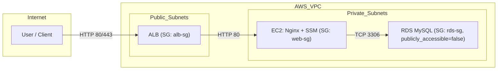
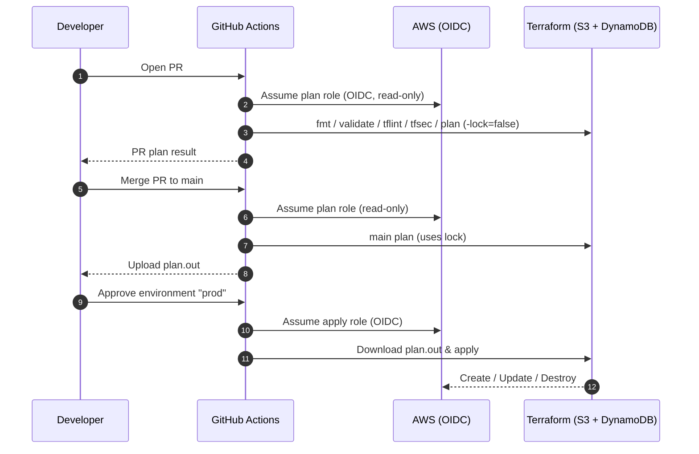

#    Terraform on AWS with GitHub OIDC


**Stack:** VPC / ALB / EC2 / RDS · **Controls:** OIDC (no keys), Remote State + Lock, Least-Privilege

A minimal, interview-ready Infrastructure-as-Code project that demonstrates **GitHub Actions OIDC** (short-lived credentials), **S3 state + DynamoDB lock**, and a pragmatic path to **least privilege** across **VPC, ALB, EC2, and RDS**. Modules are switchable via `enable_*` flags and use `for_each` for clean create/destroy by PR.

---


> Lean, production-oriented Terraform on AWS. GitHub Actions OIDC (no long-lived keys), remote state with locking, least-privilege CI/CD, and switchable modules.

### Highlights
- **OIDC (no long-lived keys):** GitHub Actions assumes AWS roles via OIDC (separate plan/apply roles).
- **Remote state + locking:** S3 backend + DynamoDB lock; no state files in the repo.
- **SG→SG / RDS private / SSM (no SSH):** ALB-SG→EC2-SG (80/443), EC2-SG→RDS-SG (3306); RDS `publicly_accessible=false`; EC2 via Session Manager.
- **PR read-only, main manual-gated apply:** PR runs fmt/lint/validate/plan; `main` runs plan + **manual** `apply`.
- **Feature-flag modules:** `enable_*` booleans with `for_each` (e.g., `enable_alb`, `enable_rds`) to add/remove stacks safely.

---

## Table of Contents
- [System Architecture](#system-architecture)
- [CI/CD Flow](#cicd-flow)
- [Repository Layout](#repository-layout)
- [Quick Start (Day-0 → Day-1)](#quick-start-day-0--day-1)
- [Security Model (OIDC & Least Privilege)](#security-model-oidc--least-privilege)
- [Remote State & Locking](#remote-state--locking)
- [Cost & Networking Notes](#cost--networking-notes)
- [Operate / Toggle / Clean Up](#operate--toggle--clean-up)
- [Troubleshooting](#troubleshooting)
- [Design Rationale & Trade-offs](#design-rationale--trade-offs))
- [Keep terraform-docs away from this README](#keep-terraform-docs-away-from-this-readme)


---

## System Architecture



**Key choices**
- **RDS private-only** (`publicly_accessible=false`), access via **SG→SG** from EC2 on 3306.
- **ALB public**, forwards only to EC2 on 80.
- **Session Manager (SSM)** on EC2 (no SSH keys).
- **Cost vs. safety:** demo uses minimal NAT assumptions; production should consider NAT per AZ.

---

## CI/CD Flow



**Why two plans?**
PR plan is read-only (no lock). `main` plan captures the exact changes and produces `plan.out`. The **apply** job must use the **same** `plan.out` (guarded by environment approval) for safety and auditability.

---

## Repository Layout

```
.
├─ envs/
│  └─ dev/
│     ├─ main.tf            # root module (for_each + enable_* flags)
│     ├─ variables.tf       # env-level inputs
│     ├─ dev.tfvars         # values (enable_*, rds_password, azs, CIDRs...)
│     ├─ backend.tf         # S3 + DynamoDB lock
│     └─ outputs.tf
├─ modules/
│  ├─ vpc/                  # VPC + subnets + routes + IGW/NAT (if any)
│  ├─ ec2/                  # EC2 + SSM + SG (user-data installs Nginx)
│  ├─ alb/                  # ALB + target group + listener
│  └─ rds/                  # RDS + subnet group + SG (SG→SG)
└─ .github/workflows/
   └─ terraform-ci.yml      # PR plan (OIDC read-only), main plan/apply (with approvals)
```

---

## Quick Start (Day-0 → Day-1)

### A. Prepare AWS (once)
1. **S3 state bucket** (e.g., `my-terraform-state-<acct>`), **versioning ON**.
2. **DynamoDB lock table** (e.g., `tf-locks`, PK `LockID` as String).
3. **GitHub OIDC provider**: `https://token.actions.githubusercontent.com`.
4. **Two IAM roles** (trust restricted to your repo+ref):
   - `gha-oidc-tf-plan` — read-only plan role.
   - `gha-oidc-tf-apply` — apply role (gated by environment approval).
5. Save role ARNs as GitHub Secrets:
   `AWS_GHA_PLAN_ROLE_ARN`, `AWS_GHA_APPLY_ROLE_ARN`.

### B. Configure backend & variables
- In `envs/dev/backend.tf`, set bucket/region/table.
- In `envs/dev/dev.tfvars`, set CIDRs, subnets, and **enable flags**:
  ```hcl
  enable_vpc = true
  enable_ec2 = true
  enable_alb = true
  enable_rds = true
  rds_password = "CHANGE_ME_FOR_DEMO ONLY"
  ```

### C. Open your first PR
- Commit module changes → open PR.
- Checks run: `fmt`, `validate`, `tflint`, `tfsec`, **plan (-lock=false)**.
- Review plan, merge when green.

### D. On `main`
- `main` workflow runs **plan** (with lock) and uploads `plan.out`.
- Approve the **environment** (e.g., `prod`) → **apply** runs using the uploaded `plan.out`.

---

## Security Model (OIDC & Least Privilege)

- **OIDC**: no long-lived keys, short-lived federated creds.
- **PR plan role** (read-only):
  - S3 state read, limited `iam:Get*`/`iam:List*`, `ec2:Describe*`, `elasticloadbalancing:Describe*`, `rds:Describe*`.
- **Apply role** (elevated but bounded):
  - Initially **service-scoped** (`ec2:*`, `elasticloadbalancing:*`, `rds:*`, `iam:PassRole`, selected `iam:*PolicyVersion`, etc.).
  - Tighten to **resource ARNs** over time.
- **Environment protection**: required reviewers before apply.
- **Branch protection**: PR required, required checks, block force-push & deletion on `main`.

---

## Remote State & Locking

- **State:** S3
- **Locking:** DynamoDB
- PR plan uses `-lock=false` (no lock). `main` plan/apply take the lock to serialize changes and prevent drift or double-apply.

---

## Cost & Networking Notes

- **Private data plane:** RDS is private-only, SG→SG from EC2.
- **Public entry:** ALB in public subnets; forward to EC2 on 80.
- **NAT strategy:** demo keeps costs low; production typically uses **one NAT per AZ** for availability.

---

## Operate / Toggle / Clean Up

- Toggle modules in `dev.tfvars`:
  ```hcl
  enable_ec2 = false
  enable_alb = false
  enable_rds = false
  ```
- Open PR → plan shows destroys → merge → approve apply.
- You may keep the **IAM/OIDC** module for future projects (very low cost).

---

## Troubleshooting (Most Common)

- **403 on S3 / `HeadObject`**
  - Ensure plan/apply roles include: `s3:GetObject`, `s3:GetObjectVersion`, `s3:ListBucket`, `s3:GetBucketLocation`.
  - Bucket policy permits those role ARNs.

- **`GetOpenIDConnectProvider` / `iam:GetPolicy` denied** (during plan)
  - Add read-only IAM `Get*`/`List*` to the **plan** role (safe; no mutation).

- **Apply says “Saved plan is stale”**
  - Re-run `main` plan; then re-run apply (always consume the most recent `plan.out`).

- **Destroy errors (EC2/instance profile)**
  - Allow in **apply** role: `iam:RemoveRoleFromInstanceProfile`, `iam:DetachRolePolicy`, `iam:DeleteInstanceProfile`
    (limit to ARNs created by this project).

- **RDS plan fails on Describe/ListTags**
  - Include `rds:Describe*` and `rds:ListTagsForResource` in the **plan** role.

---

## Design Rationale & Trade-offs

- **Identity & CI/CD**
  GitHub OIDC (no long-lived keys). PR uses a read-only role for `fmt/lint/plan`; `main` runs `plan` + manual-gated `apply`.

- **Remote state & locking**
  S3 backend + DynamoDB lock to avoid concurrent writes; server-side encryption; state kept per-env.

- **Networking & access**
  ALB in public subnets; EC2 in private; RDS `publicly_accessible=false`. EC2 ingress only from ALB SG; RDS ingress only from EC2 SG (SG→SG).

- **Ops posture**
  SSM Session Manager (no SSH keys or inbound 22). User-data installs Nginx for health checks.

- **Cost vs reliability**
  Lab uses single NAT (keep bills low). In production, recommend 1 NAT per AZ and multi-AZ RDS.

- **Least privilege path**
  Start with admin-like service scopes to bootstrap → then converge to resource-level ARNs (IAM policy versions reviewed via CI).

- **Structure**
  `modules/` (vpc, ec2, alb, rds, iam) + `envs/dev` composition. Feature-flag style `enable_*` with `for_each` to create/destroy via PRs.

### What reviewers can verify quickly

- OIDC trust policy matches `repo:ORG/REPO:*` scopes（PR vs main 区分）
- S3 backend has bucket+lock table; state not in repo
- RDS not public; Security Groups are SG→SG, no `0.0.0.0/0` to DB
- EC2 has SSM role/profile; no SSH key pair in TF
- ALB → TargetGroup → Instance attachment OK；listener forwards 80
- CI 按 PR/MAIN 分离，`apply` 需手动批准；policy 限到所需服务/资源


---

## Keep terraform-docs away from this README

Scope `terraform-docs` to modules only so it won’t rewrite the root README:

```yaml
# .pre-commit-config.yaml (snippet)
repos:
  - repo: local
    hooks:
      - id: terraform-docs
        name: terraform-docs (modules only)
        entry: bash -lc 'terraform-docs .'
        language: system
        files: ^modules/
```

---

## License

MIT (or your preference).
